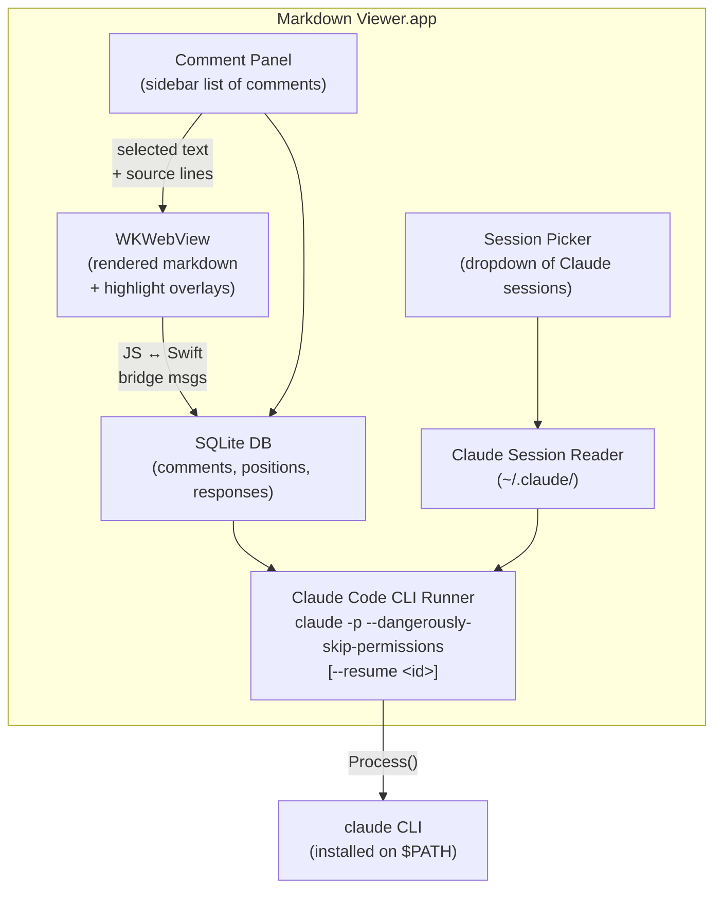

# Plan: Document Comments & Claude Code Integration

## Overview

Add a Google Docs-style comment interface to Markdown Viewer that lets users highlight text, leave edit suggestions, and trigger Claude Code CLI to apply those edits to the source markdown file. Optionally attach a prior Claude Code session as context so the AI understands the broader project intent.

---

## Problem Statement

Current workflow is disjointed:
1. Iterate on an idea in Claude Code
2. `!open file.md` to preview the document
3. Notice something to change — must switch back to the terminal
4. Repeat

The goal is to close this loop inside Markdown Viewer itself.

---

## Architecture



---

## Data Model (SQLite)

Single database file per document, stored alongside it or in an app-scoped location (`~/Library/Application Support/MarkdownViewer/comments.db`). A single shared DB is simpler than per-file databases.

### Tables

```sql
CREATE TABLE documents (
    id          INTEGER PRIMARY KEY,
    file_path   TEXT NOT NULL UNIQUE,
    created_at  TEXT NOT NULL DEFAULT (datetime('now'))
);

CREATE TABLE comments (
    id              INTEGER PRIMARY KEY,
    document_id     INTEGER NOT NULL REFERENCES documents(id),
    -- Source position (line-based, relative to the .md file)
    start_line      INTEGER NOT NULL,
    end_line        INTEGER NOT NULL,
    selected_text   TEXT NOT NULL,       -- the highlighted source text
    comment_text    TEXT NOT NULL,        -- user's edit suggestion / note
    status          TEXT NOT NULL DEFAULT 'pending',
                    -- pending | applying | applied | rejected | error
    created_at      TEXT NOT NULL DEFAULT (datetime('now')),
    updated_at      TEXT NOT NULL DEFAULT (datetime('now'))
);

CREATE TABLE claude_responses (
    id          INTEGER PRIMARY KEY,
    comment_id  INTEGER NOT NULL REFERENCES comments(id),
    response    TEXT NOT NULL,            -- Claude's reply or diff summary
    session_id  TEXT,                     -- Claude Code session used
    created_at  TEXT NOT NULL DEFAULT (datetime('now'))
);
```

### Why SQLite

- Ships with macOS (libsqlite3) — no extra dependency needed
- Can use the C API directly via Swift's `import SQLite3`
- Lightweight, single-file, no server
- Concurrent read-safe for the WebView JS + Swift sides
- Easy to query for "all pending comments on this file"

---

## Feature Breakdown

### Phase 1: Text Selection & Comment Creation

**Goal:** User can select text in the rendered preview and attach a comment.

#### 1a. Source-line annotation during rendering

The swift-markdown `Document` AST nodes carry `SourceRange` (line + column). During `MarkdownRenderer.render()`, annotate emitted HTML elements with `data-source-start` and `data-source-end` attributes:

```html
<p data-source-start="5" data-source-end="7">Some paragraph text...</p>
<h2 data-source-start="9" data-source-end="9">Section Title</h2>
```

This creates a mapping from rendered DOM back to source lines.

**Files to modify:**
- `MarkdownRenderer.swift` — emit `data-source-*` attributes on block-level elements

#### 1b. JavaScript selection capture

New JS file (`comments.js`) that:
- Listens for `mouseup` / selection events
- When user selects text, finds the enclosing `data-source-start/end` attributes
- Computes a precise source range `{startLine, endLine, selectedText}`
- Shows a small "Add Comment" popover near the selection
- Posts a `webkit.messageHandlers.addComment.postMessage(...)` to Swift

**Files to add:**
- `Resources/comments.js`
- `Resources/comments.css` (highlight styling)

#### 1c. Comment highlight overlay

Render existing comments as yellow/colored highlights in the WKWebView:
- On page load, Swift sends all comments for the current file to JS
- JS walks the DOM, finds elements matching each comment's source range, and wraps the relevant text nodes in `<mark class="comment-highlight" data-comment-id="N">` spans
- Clicking a highlight scrolls the comment panel to that comment

#### 1d. Swift-side WKScriptMessageHandler

Register new message handlers in `WebView.swift`:
- `addComment` — receives selection data, opens the comment editor
- `commentClicked` — receives comment ID, focuses it in the sidebar

---

### Phase 2: Comment Panel (Sidebar)

**Goal:** A sidebar listing all comments for the current document with inline editing.

#### 2a. CommentSidebar view

New SwiftUI view, similar to `OutlineSidebar` in structure:
- List of `CommentRow` views, each showing:
  - The selected text (truncated, styled as a quote)
  - The comment text
  - Status badge (pending / applied / error)
  - Claude's response (if any)
  - Delete button
- "Apply with Claude" button at the bottom (or per-comment)
- Sorted by source line position

#### 2b. Comment editor sheet/popover

When "Add Comment" is triggered (from JS or from the sidebar):
- A text field for the edit suggestion / instruction
- Preview of the selected text
- Save / Cancel buttons
- Writes to SQLite via a new `CommentStore` class

#### 2c. CommentStore (SQLite data layer)

New class `CommentStore`:
- `init()` — opens/creates the shared SQLite database
- `createComment(filePath:startLine:endLine:selectedText:commentText:)` -> Comment
- `commentsForFile(path:)` -> [Comment]
- `updateStatus(commentId:status:)`
- `addResponse(commentId:response:sessionId:)`
- `deleteComment(commentId:)`
- Uses `import SQLite3` (system library, no package dependency)

#### 2d. Integration with ContentView

- Add a new sidebar mode or a trailing sidebar (right side)
- Toggle via menu item `View > Comments` (Cmd+Shift+C or similar)
- The comment sidebar coexists with the existing left sidebars (Outline / Files)

**Files to add:**
- `Views/CommentSidebar.swift`
- `Views/CommentRow.swift`
- `Views/CommentEditor.swift`
- `Stores/CommentStore.swift`
- `Models/Comment.swift`

**Files to modify:**
- `ContentView.swift` — add trailing sidebar
- `WebView.swift` — register new message handlers
- `MarkdownViewerApp.swift` — add menu item
- `MarkdownHTMLTemplate.swift` — inject comments.js/css

---

### Phase 3: Claude Code CLI Integration

**Goal:** Send comments to Claude Code for application to the source file.

#### 3a. Prompt construction (context engineering)

Build a structured prompt from the comments:

```
You are editing the markdown file at: /path/to/document.md

The user has left the following edit comments on the document. Each comment
references specific lines and includes the user's requested change.
Apply ALL of the pending changes to the file.

## Comments

### Comment 1 (lines 5-7)
Selected text:
> The quick brown fox jumps over the lazy dog.

Requested edit:
"Make this more formal and add a citation"

### Comment 2 (lines 12-12)
Selected text:
> ## Teh Architecture

Requested edit:
"Fix the typo in this heading"

---

Apply each requested edit to the file. Preserve the overall structure
and formatting. Only modify the sections referenced by the comments.
```

Key context engineering decisions:
- Include the full file path so Claude can read/write it
- Quote the selected text so Claude can locate it even if lines shift
- Number the comments for traceability
- Keep the system prompt focused: "apply edits, preserve structure"
- Optionally append `--resume <session-id>` context (Phase 4)

#### 3b. ClaudeCodeRunner

New class to shell out to the CLI:

```swift
class ClaudeCodeRunner {
    func applyComments(
        filePath: String,
        comments: [Comment],
        sessionId: String?,     // optional resume
        onOutput: @escaping (String) -> Void,
        onComplete: @escaping (Bool) -> Void
    )
}
```

Implementation:
- Build the prompt string per 3a
- Spawn `Process()` with:
  - `/usr/bin/env claude`
  - Arguments: `-p`, `--dangerously-skip-permissions`, and optionally `--resume`, `<session-id>`
  - Pipe the prompt via stdin
- Stream stdout/stderr for progress display
- On completion, update comment statuses in SQLite
- Trigger file-reload in DocumentState (existing file-change detection should handle this automatically since the file watcher already exists in `AppDelegate`)

#### 3c. Progress UI

While Claude is working:
- Show an inline progress indicator in the comment sidebar
- Stream Claude's output into a collapsible "Claude Response" section per comment (or a shared log view at the bottom)
- On success: mark comments as `applied`, show green checkmarks
- On error: mark as `error`, show the error message

**Files to add:**
- `Services/ClaudeCodeRunner.swift`
- `Services/PromptBuilder.swift`

**Files to modify:**
- `CommentSidebar.swift` — add "Apply" button, progress display

---

### Phase 4: Session Context (Resume)

**Goal:** Let the user attach a prior Claude Code session so Claude has full project context when applying edits.

#### 4a. Claude session discovery

Claude Code stores conversation data in `~/.claude/projects/`. We need to:
- Scan for available sessions
- Parse session metadata (ID, title/first message, timestamp)
- Present them in a human-readable list

The exact storage format needs investigation, but likely involves JSON files with conversation turns. We can read the session list with:
```bash
claude sessions list --json  # if available
```
Or parse the filesystem directly.

#### 4b. SessionPicker view

A dropdown/popover in the comment sidebar or toolbar:
- Shows recent Claude Code sessions with:
  - Human-readable title (first user message, truncated)
  - Timestamp
  - Session ID
- "None" option (no session context)
- Selected session ID is passed to `ClaudeCodeRunner`

When a session is selected and `--resume <session-id>` is used, Claude picks up the full prior conversation which gives it project context, design decisions, and coding intent.

#### 4c. Session context toggle

- A toggle switch: "Include Claude session context"
- When enabled, shows the SessionPicker dropdown
- Persisted per-document in the SQLite DB or in UserDefaults

**Files to add:**
- `Views/SessionPicker.swift`
- `Services/ClaudeSessionReader.swift`

---

## Implementation Order

| Step | Phase | Description | Depends On |
|------|-------|-------------|------------|
| 1 | 1a | Add `data-source-*` attributes to rendered HTML | — |
| 2 | 2c | SQLite CommentStore + Comment model | — |
| 3 | 1b | JavaScript selection capture + Add Comment popover | Step 1 |
| 4 | 1c | Comment highlight rendering in WebView | Steps 1, 2 |
| 5 | 2a-b | CommentSidebar + CommentEditor UI | Steps 2, 3 |
| 6 | 2d | Integrate sidebar into ContentView + menus | Step 5 |
| 7 | 3a-b | PromptBuilder + ClaudeCodeRunner | Step 2 |
| 8 | 3c | Progress UI + status updates | Steps 6, 7 |
| 9 | 4a-c | Session discovery + SessionPicker | Step 7 |

Steps 1 and 2 can be done in parallel. Steps 3 and 4 can be partially parallelized. Steps 7-9 are the Claude integration chain.

---

## New Files Summary

```
MarkdownViewer/
├── Models/
│   └── Comment.swift                  # Comment data model
├── Stores/
│   └── CommentStore.swift             # SQLite CRUD layer
├── Services/
│   ├── ClaudeCodeRunner.swift         # CLI process runner
│   ├── PromptBuilder.swift            # Context engineering
│   └── ClaudeSessionReader.swift      # Session discovery
├── Views/
│   ├── CommentSidebar.swift           # Right sidebar
│   ├── CommentRow.swift               # Single comment view
│   ├── CommentEditor.swift            # New comment sheet
│   └── SessionPicker.swift            # Session dropdown
└── Resources/
    ├── comments.js                    # Selection + highlight logic
    └── comments.css                   # Highlight styling
```

## Modified Files Summary

| File | Change |
|------|--------|
| `MarkdownRenderer.swift` | Emit `data-source-*` attributes from AST source ranges |
| `MarkdownHTMLTemplate.swift` | Inject `comments.js` and `comments.css` |
| `WebView.swift` | Register `addComment` / `commentClicked` message handlers |
| `ContentView.swift` | Add trailing comment sidebar, comment state |
| `MarkdownViewerApp.swift` | Add `View > Comments` menu item |
| `DocumentState.swift` | Add `CommentStore` reference, comment-related state |
| `Package.swift` | Possibly no change (SQLite3 is a system library) |

---

## Open Questions & Risks

1. **Source range accuracy:** The swift-markdown AST `SourceRange` gives line numbers, but after Claude edits the file, line numbers shift. Mitigation: use `selectedText` as a secondary anchor for re-matching after edits. Could also re-parse and diff after Claude finishes.

2. **Inline vs. block granularity:** Source ranges are per-block-element (paragraph, heading, list item). For precise inline selections (e.g., highlighting one word in a paragraph), we'd need character-level offsets within the source line. Phase 1 can start with block-level granularity and refine later.

3. **Claude CLI availability:** Need to detect whether `claude` is on `$PATH` and show a helpful error if not. Could use `which claude` check on app launch or on first "Apply" action.

4. **Session storage format:** The exact format of Claude Code's session storage (`~/.claude/`) needs investigation. This is the riskiest unknown — if the format isn't stable or documented, the session reader may be fragile. Fallback: let the user paste a session ID manually.

5. **Concurrent edits:** If the user edits the file externally while comments are pending, line numbers may be stale. The existing file-change watcher in `AppDelegate` already prompts for reload — we could invalidate/re-map comments on reload.

6. **Multiple comments, one Claude call:** Batching all pending comments into a single Claude invocation is more efficient and produces more coherent edits than applying them one-by-one. The prompt in 3a is designed for batch application. However, if one comment fails, we need graceful partial-failure handling.

7. **`--dangerously-skip-permissions` scope:** This flag skips all permission prompts. Since we're only asking Claude to edit a specific markdown file, the risk is low, but worth noting in any user-facing documentation.
