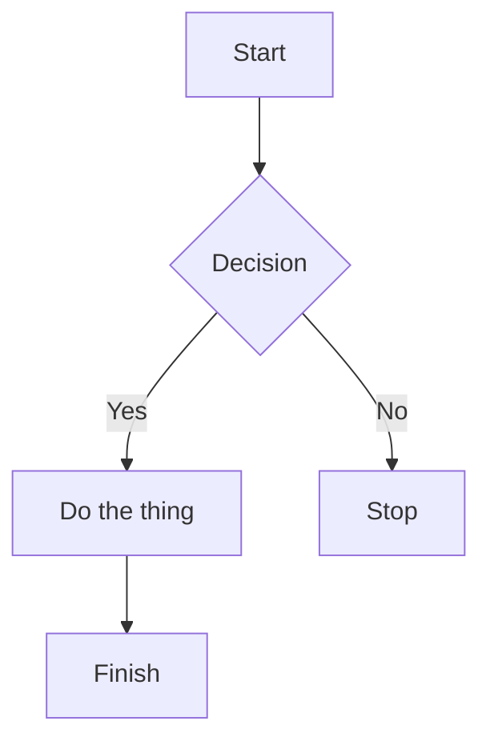
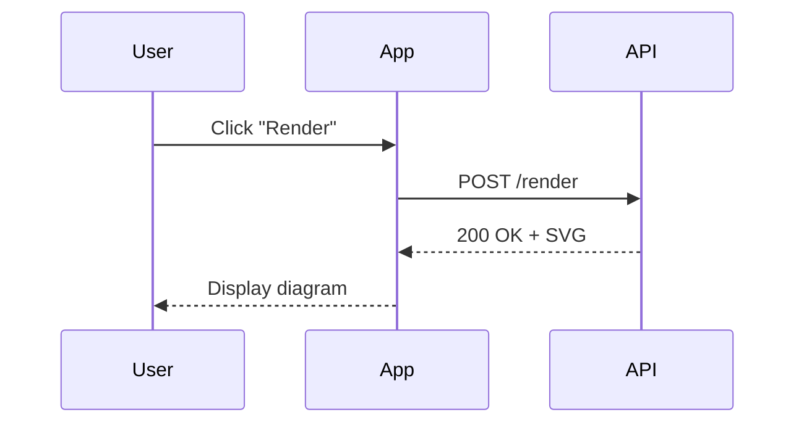
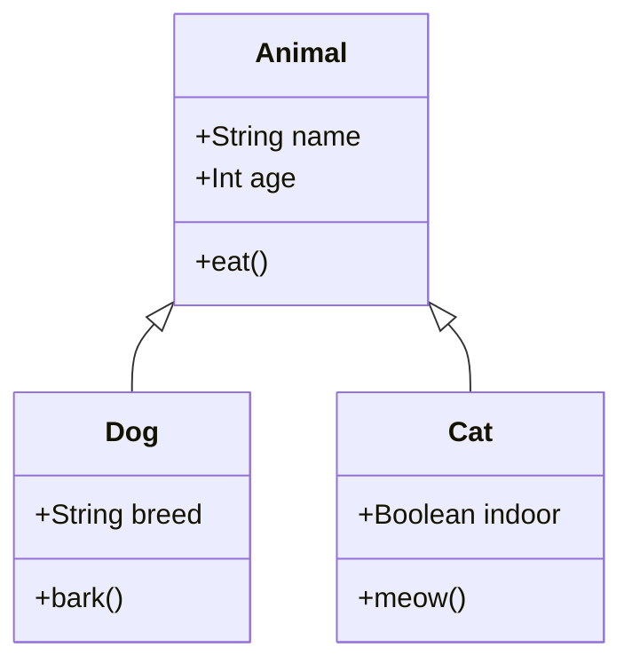
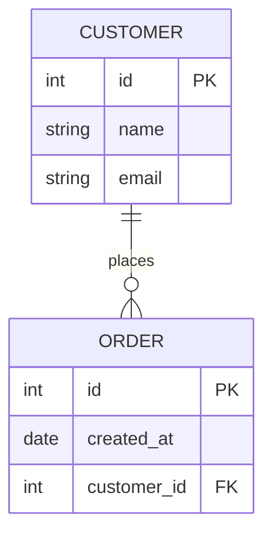
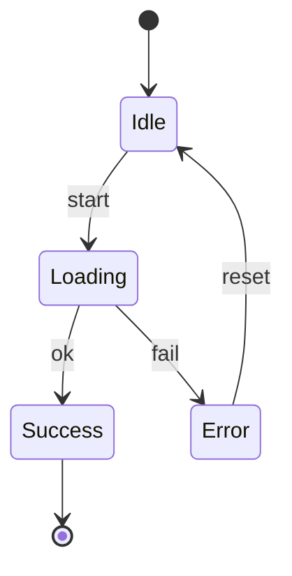

# Mermaid Rendering Test

Use this file to validate Beautiful Mermaid rendering. It includes supported diagram types: flowchart, sequence, class, ER, and state.

## Flowchart

## Sequence Diagram

## Class Diagram

## ER Diagram

## State Diagram

